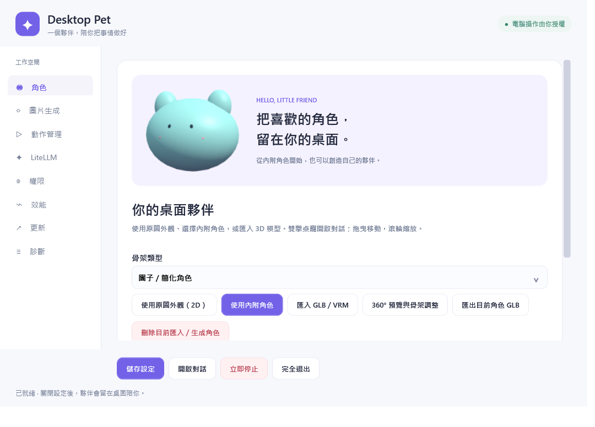
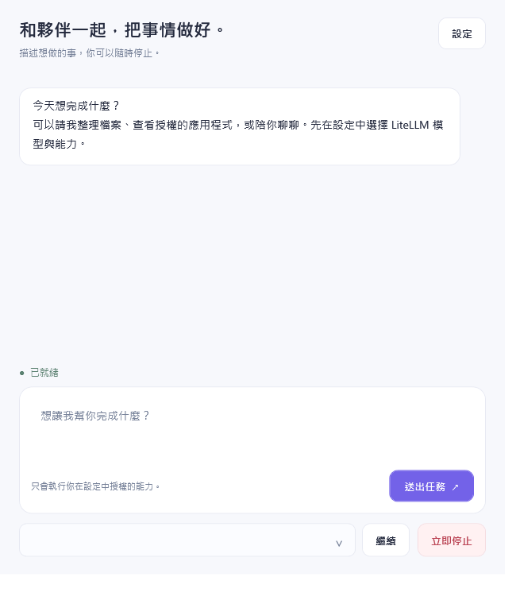

# Desktop Pet Agent

Windows 11 x64 桌面寵物與使用者授權的 AI 助理。

[下載 alpha.3 安裝程式](https://github.com/SamChengYo/desktop-pet-releases/releases/download/v0.1.0-alpha.3/DesktopPetAgent-win-Setup.exe) · [版本紀錄](https://github.com/SamChengYo/desktop-pet-releases/releases) · [功能狀態](FEATURE-STATUS.md)

執行 `DesktopPetAgent-win-Setup.exe` 安裝，不需要手動安裝 .NET、Python、Node.js、Git 或 Docker。WebView2 由安裝程式處理。可選 CPU 生成與 LiteLLM runtime 在使用者選擇後下載，模型權重不在基本安裝包中。

每次啟動自動偵測更新；可選擇使用新版或繼續目前版本。更新資訊有 RSA 簽章，下載檔案有 SHA-256 驗證。

內附三類原創 3D 角色。支援圖片 CPU 生成、GLB 預覽與近似綁骨、動作、系統匣與 AI 多步工具任務。電腦操作預設關閉，只有設定中勾選的能力可執行；每次開啟程式需重新授權。Ctrl+Alt+F12 立即停止；Ctrl+Alt+P 開啟聊天。

角色頁的「使用原圖外觀（2D）」可直接採用 PNG/JPEG，保留原圖外觀並移除相連純白背景；複雜背景請準備透明 PNG。此模式支援桌寵拖曳、縮放與對話，沒有立體模型與骨架全身動作。需要 3D 時，使用圖片生成頁：生成 → 預覽 → 近似綁骨／調整 → 採用。

3D 生成保留原圖正面色彩，側面、背面與坐姿肢體由模型推測，可能失真。程序完成與匯出通過不代表外觀完全還原，採用前請旋轉預覽。

alpha.3 修復首次下載生成 runtime 的 Windows ZIP 檔案占用問題。請使用 alpha.3 或後續版本；alpha.1／alpha.2 保留為歷史 prerelease。

AI 功能需設定自己的 LiteLLM Gateway 或 provider。不要把 API key 寫入 GitHub issue。實際外部模型呼叫需使用者憑證。

此為 prerelease：Windows 10、低顯存 GPU 生成、臉部動畫、完整骨架重定向和乾淨 VM 更新故障回復尚未验收。沒有 Windows Authenticode 憑證；請保留作業系統防護。使用 CPU 生成建議至少 6 GiB 可用 RAM，結果需預覽與必要手動調整。

此 repo 只放產品說明、授權、版本資訊與安裝檔，主程式原始碼保存在私有 repository。
